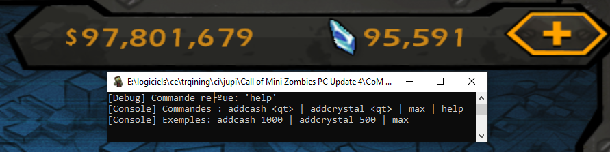

## DOWNLOAD AND COMPILATION:
step 1:
clone this repo with
```
git clone https://github.com/BalenPoilu/miniZombi3D-IL2CPP
```
step 2:
Go to the main directory and start MSCV with a double click on IL2CppDLL.sln

step 3:
Compile the code to create a DLL


Now we finish to compil the code to use it, its time to inject sooo

## INJECTING A DLL ?
Use an injector ! (I use : [system informer](https://systeminformer.com))

## IG scren


### IF GAME IS UPDATED:
download [ILCPPINSPECTOR](https://github.com/LukeFZ/Il2CppInspectorRedux)
and regen a c++ scarffold to update appdata/